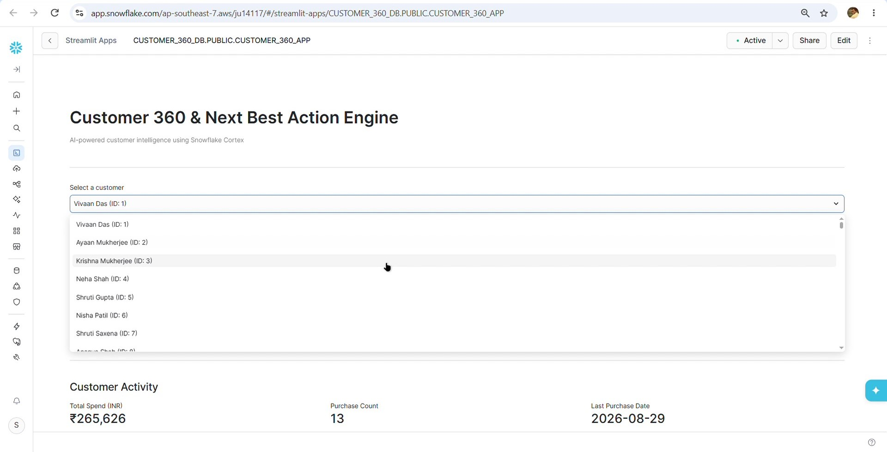
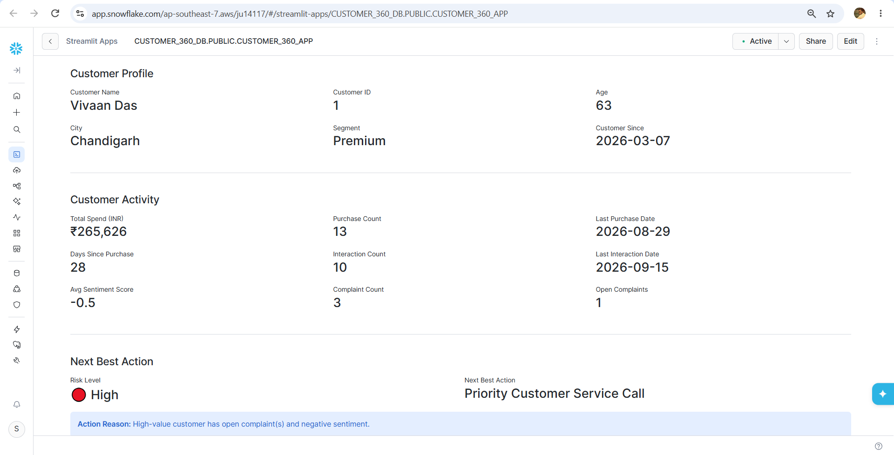
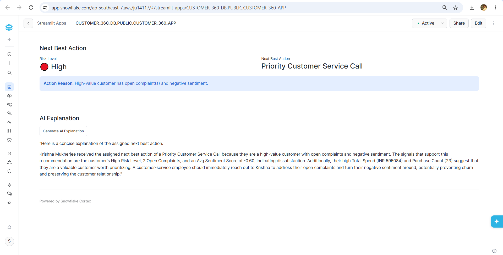

# Customer 360 & Next Best Action Engine

An AI-powered customer intelligence application built with **Snowflake, Snowflake Cortex AI, and Streamlit**. The application combines customer purchases, interactions, and complaints into a unified 360° customer view and uses customer signals to determine the next best action.

## Demo

### Application Screenshots

**Customer Selection**



**Customer 360° Details**



**Next Best Action & AI Explanation**



### Presentation

The complete project presentation is available here:

[Customer 360 & Next Best Action Engine Presentation](presentation/customer_360.pptx)

---

## Business Problem

Customer information is often spread across multiple sources such as purchase history, customer interactions, and complaints.

This makes it difficult for sales and support teams to quickly answer questions such as:

* Who is this customer?
* How valuable and active is the customer?
* Are there signs of customer risk?
* What action should be taken next?
* Why is that action appropriate?

This project brings these signals together into a single customer view and converts them into actionable recommendations.

---

## Solution

The application creates a **Customer 360° view** by combining:

* Customer demographics and segmentation
* Purchase history
* Customer interactions
* Complaint information
* Engagement and sentiment signals

These signals are used to determine:

1. **Customer profile**
2. **Activity summary**
3. **Risk level**
4. **Next Best Action**
5. **AI-generated explanation**

Snowflake Cortex AI is then used to generate a natural-language explanation of the recommended action, allowing users to understand the reasoning behind the recommendation.

---

## Key Features

### 👤 Customer 360° Profile

View important customer information in one place, including:

* Customer demographics
* Customer segment
* Tenure
* Purchase activity
* Interaction history
* Complaint history

### 📊 Customer Activity Summary

The application summarizes important customer signals such as:

* Total spend
* Purchase frequency
* Recency
* Number of interactions
* Sentiment information

### ⚠️ Risk Assessment

Customers are classified into:

* **High Risk**
* **Medium Risk**
* **Low Risk**

The classification is based on customer activity and engagement signals available in the unified customer data.

### 🎯 Next Best Action

The application recommends an appropriate action based on the customer's current situation.

This converts customer data into an actionable recommendation instead of only displaying historical information.

### 🤖 AI Explanation

Snowflake Cortex AI generates a natural-language explanation for the recommended action.

This helps answer:

> **Why was this action recommended for this customer?**

---

## Architecture

```text
┌──────────────────┐
│    CUSTOMERS     │
│     1,000        │
└────────┬─────────┘
         │
         │
┌────────▼─────────┐
│    PURCHASES     │
│     8,000        │
└────────┬─────────┘
         │
         │
┌────────▼─────────┐
│   INTERACTIONS    │
│     4,000        │
└────────┬─────────┘
         │
         │
┌────────▼─────────┐
│    COMPLAINTS    │
│     1,000        │
└────────┬─────────┘
         │
         ▼
┌─────────────────────────┐
│     CUSTOMER_NBA        │
│                         │
│ Unified Customer 360   │
│ Risk + NBA Information │
└────────────┬────────────┘
             │
             ▼
┌─────────────────────────┐
│    STREAMLIT APP        │
│                         │
│ Customer Profile        │
│ Activity & Risk         │
│ Next Best Action        │
└────────────┬────────────┘
             │
             ▼
┌─────────────────────────┐
│    SNOWFLAKE CORTEX     │
│                         │
│ AI-generated explanation│
└─────────────────────────┘
```

---

## Data

The project uses four source datasets.

| Dataset            |  Rows | Description                                  |
| ------------------ | ----: | -------------------------------------------- |
| `customers.csv`    | 1,000 | Customer demographics and segmentation       |
| `purchases.csv`    | 8,000 | Customer purchase transactions               |
| `interactions.csv` | 4,000 | Customer support and engagement interactions |
| `complaints.csv`   | 1,000 | Customer complaints, status, and categories  |

The datasets are used to create a unified customer-level view inside Snowflake.

---

## Project Structure

```text
Customer-360-Next-Best-Action-Engine/
│
├── README.md
├── .gitignore
├── snowflake.yml
├── streamlit_app.py
│
├── data/
│   ├── customers.csv
│   ├── purchases.csv
│   ├── interactions.csv
│   └── complaints.csv
│
├── screenshots/
│   ├── customer_selection.png
│   ├── customer_details.png
│   └── NBA-and_explanation.png
│
└── presentation/
    └── customer_360.pptx
```

---

## Technology Stack

| Technology                 | Purpose                                              |
| -------------------------- | ---------------------------------------------------- |
| **Snowflake**              | Data storage, processing, and analytics              |
| **Snowpark Python**        | Server-side Python access to Snowflake data          |
| **Streamlit in Snowflake** | Interactive customer intelligence application        |
| **Snowflake Cortex AI**    | AI-generated explanations                            |
| **Llama 3.1 70B**          | Large language model used through Cortex AI          |
| **SQL**                    | Data aggregation, transformation, and business logic |

---

## How the Application Works

### Step 1 — Customer Data

Customer information is stored across four source datasets:

`Customers → Purchases → Interactions → Complaints`

### Step 2 — Customer 360

The source data is aggregated at the customer level to create a unified view containing customer activity, engagement, complaints, and other relevant signals.

### Step 3 — Risk Assessment

Customer signals are evaluated to classify the customer's current risk level.

### Step 4 — Next Best Action

Business rules use the available customer signals to determine an appropriate next action.

### Step 5 — AI Explanation

Snowflake Cortex AI receives the relevant customer context and generates a natural-language explanation for the recommended action.

### Step 6 — Streamlit Interface

The final result is presented through an interactive Streamlit application where the user can select a customer and explore their complete profile.

---

## Snowflake Objects

The application uses the following logical layers:

```text
Source Tables
     │
     ├── CUSTOMERS
     ├── PURCHASES
     ├── INTERACTIONS
     └── COMPLAINTS
             │
             ▼
      CUSTOMER_NBA
             │
             ▼
    CUSTOMER_AI_CONTEXT
             │
             ▼
       Streamlit App
             │
             ▼
      Snowflake Cortex
```

---

## Setup

### Prerequisites

You need:

* A Snowflake account
* A Snowflake warehouse
* Access to Snowflake Cortex AI functions
* Snowflake CLI

### 1. Create Database and Schema

```sql
CREATE DATABASE IF NOT EXISTS CUSTOMER_360_DB;

USE DATABASE CUSTOMER_360_DB;

USE SCHEMA PUBLIC;
```

### 2. Load the Data

Upload the CSV files from the `data/` directory into the corresponding Snowflake tables:

```text
CUSTOMERS
PURCHASES
INTERACTIONS
COMPLAINTS
```

### 3. Create the Customer 360 Data

Build the required customer-level tables/views containing:

* Customer profile
* Purchase metrics
* Interaction metrics
* Complaint metrics
* Risk classification
* Next Best Action
* AI context

### 4. Deploy the Streamlit Application

```bash
snow streamlit deploy --open
```

---

## Example Workflow

A typical user workflow is:

```text
Select Customer
      ↓
View Customer 360°
      ↓
Review Activity & Complaints
      ↓
Check Risk Level
      ↓
View Next Best Action
      ↓
Generate AI Explanation
```

The goal is to move from **customer data → customer understanding → recommended action → explainable AI reasoning**.

---

## Project Highlights

* Built a unified **Customer 360° view** from multiple customer data sources
* Implemented customer-level activity and risk analysis in Snowflake
* Built a **Next Best Action** recommendation workflow
* Integrated **Snowflake Cortex AI** for natural-language explanations
* Developed an interactive **Streamlit in Snowflake** application
* Designed the project as an end-to-end Snowflake application rather than a standalone notebook

---

## Project Presentation

The project presentation contains the detailed business problem, solution approach, architecture, application workflow, and implementation.

📊 **[View the project presentation](presentation/customer_360.pptx)**

---

## Future Improvements

Potential extensions include:

* ML-based churn probability
* Customer lifetime value prediction
* Propensity-based action recommendations
* Real-time customer event processing
* Action effectiveness tracking
* Feedback loops to improve recommendations
* Additional customer communication channels

---

## Author

**Syed Rehan Syed Hamedsaleem**

Data Analyst | Python | SQL | Snowflake | Power BI

[GitHub](https://github.com/syedrhn0)
